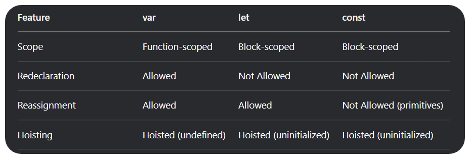

# Automation using Playwright

<details>
<summary>Things we are plan to cover</summary>

- [ ] Javascript
    - [x] Basic JS : 02/05/25 - 02/05/25
    - [ ] Functions
    - [ ] Intermediate JS

- [ ] Typescript
    - [ ] Baisc TS
    - [ ] Interfaces
    - [ ] Enums
    - [ ] Generics

- [ ] Playwright
    - [ ] Basic Playwright
    - [ ] Locators
    - [ ] Chained locators


</details>

### Javascript

- case senstive language
- interpreted

#### Varibales in Javascript
- let
- var ( not used anymore ) ( old way to declare a variable )
- const

#### Features of varibales



#### Difference between Re-declaration and Re-assignment
- Re-declaration 
```
    var greet = "Hi"
    var greet = "Hello there!"  // Here we are Re-declaring the variable
```
- Re-assignment
```
    var greet = "hi"
    greet = "hi there!"  // Here we are just assigning a new value to the pre-declared variable
```

#### Hoisting 
* When we use the variable before intializing it, is known as hoisting
``` 
var name
console.log(name)  // undefined
name = "xyz"
console.log(name)  // xyz
```

#### Conditional Statements

1. if-else
2. nested if-else
3. else if
4. switch


#### Loops

1. For loop
2. For Of loop
3. For In loop
4. while
5. do while

#### Arrays

- Array is a collection of data ( can be anything)

```
let arr = [1, null, "shubham", True, 2.14]  - hetrogeneous type of data
                        or 
let arr = [1,2,3,4,5] - homogeneous type of data
```
